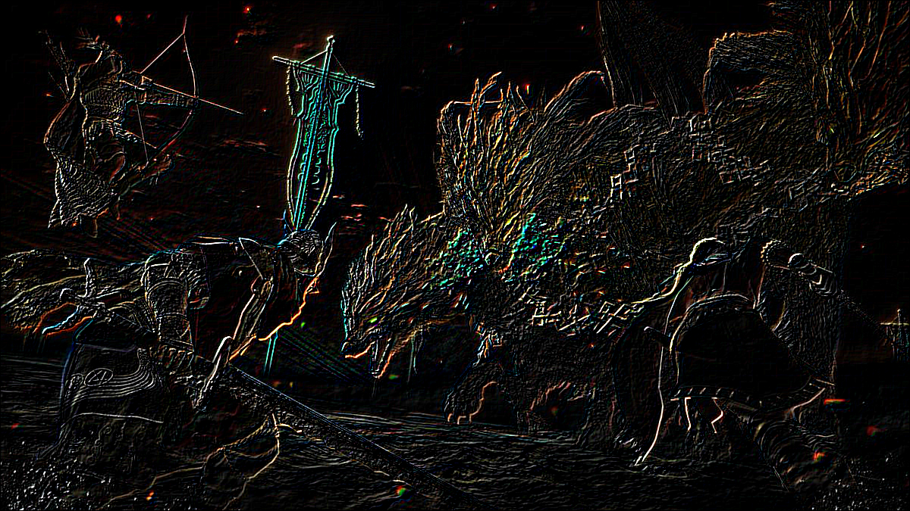

# ImageEffects
 simple image effects on jpgs

Implements a variety of image processing effects.
Performance is not optimised, and is potentially an area for
investigating SIMD or implementing parallel algorithms for multithreading.

Pixel Sorting:

Palette Restriction

Pixelation

Pixelation + Palette Restriction

Edge Detection

Box Blur + Edge Sharpening
